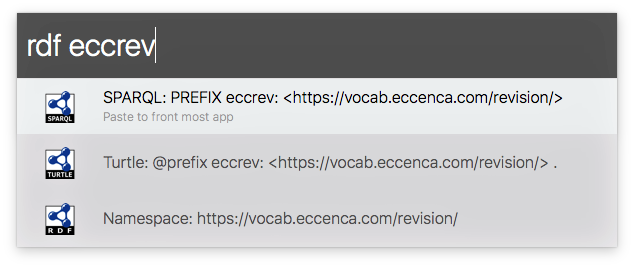

# prefix.cc namespace lookup

Lookup for namespaces using [prefix.cc](http://prefix.cc/).

## Usage

When triggered, the workflow shows the RDF namespace for a given prefix. Additionally, it shows the prefix declaration for SPARQL and Turtle syntax too.

* `rdf <PREFIX>` - lookup the namespace for PREFIX
    * `↩︎` copy entry to clipboard and paste it to front most app

## Installation

Download the [latest release](https://github.com/depressiveRobot/alfred-prefix.cc/releases).

## Credits

This workflow is inspired by the [rdf.sh](https://github.com/seebi/rdf.sh) command line tool.

## License

The MIT License (MIT)

Copyright (c) 2017 Marvin Frommhold
